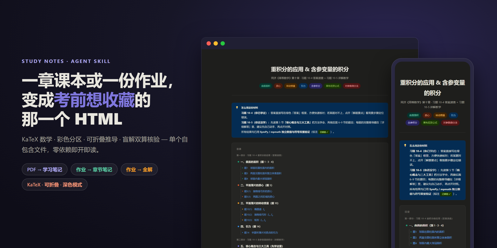
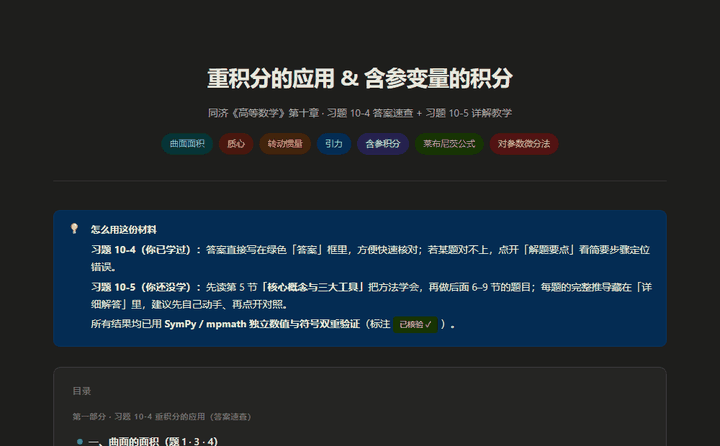
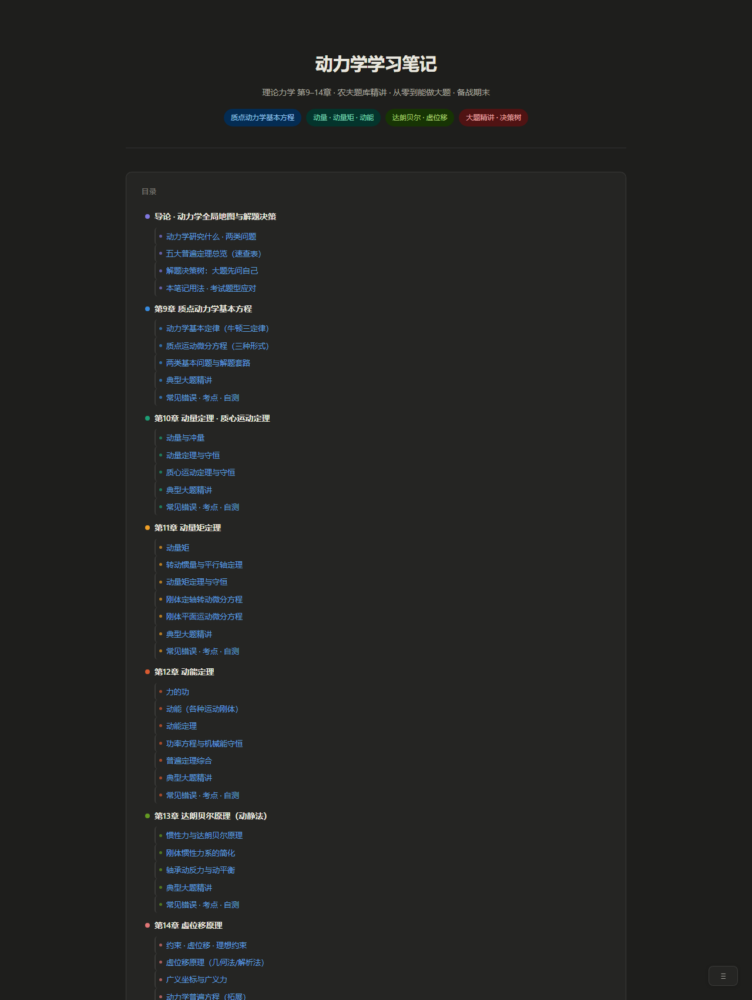
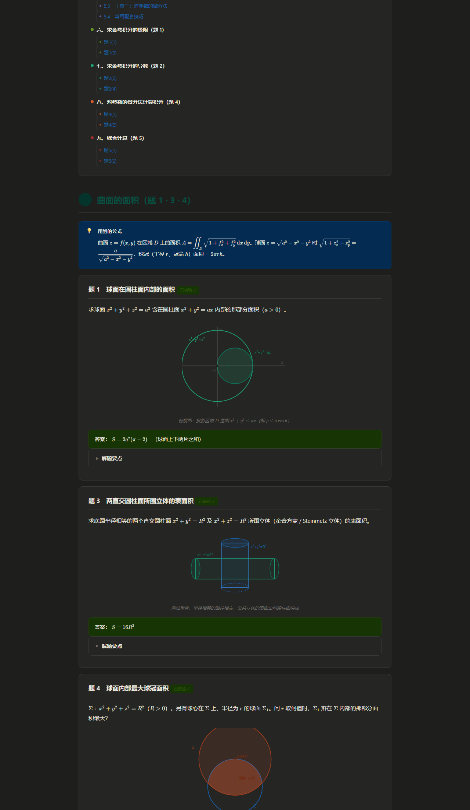
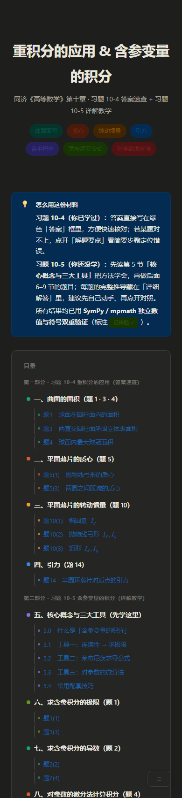

<div align="center">

# study-notes | 考前想收藏的那一个 HTML

> *「问 AI 一个知识点，得到的是一坨纯文本；公式是源码、推导铺一整屏、手机上还糊成一片。」*

[](SKILL.md)
[](https://skills.sh/ErikaAlk/study-notes)
[](https://clawhub.ai/ErikaAlk/study-notes)
[](https://claude.com/claude-code)
[](LICENSE)

**把一章课本或一份作业，变成考前就想收藏的那一个 HTML——KaTeX 数学、彩色分区、可折叠推导，每道题都盲解双算核验过。**

[看效果](#效果示例) · [安装](#快速开始) · [触发方式](#触发方式) · [和同类有什么不同](#它和同类有什么不同) · [安全边界](#安全边界)

</div>

---


<sub>主视觉由 `scripts/make_hero.py` 用真实运行截图合成，非设计稿。完整产物见 [examples/](examples/)。</sub>

---

## 它解决什么问题

你让 AI 讲过一个知识点吗？它给你一段散文：概念是对的，公式是 `\frac` 的源码，推导从第一行铺到最后一行没法收起，例题和正文混在一起，手机上一行公式横着溢出。你想要的其实是一份**能直接当复习资料的成品**——而不是又一坨要你自己再排版的文本。

这个 skill 换了一个思路：**笔记不是写出来的，是搭出来的。** 它按输入分三种模式，跑一个四段工作流——**先规划**（读源、建目录、定一份共享规范：符号表、配色、数学规则），**再分发**（一个概念一节、各自写深，而不是一遍过把十个概念糊在一起），**重点是核验**（每道例题/每道作业题先解一遍，再**只看题面盲解一遍**，非平凡的数都用 `python`/`sympy` 算，两路答案不一致绝不交付），**最后才组装**并做一致性收尾。

产出是**一个自包含 HTML 文件**：KaTeX 把每个公式排好，推导收在可折叠块里、想看再点开，章节按概念配色，例题/常见错误/考试重点各有 callout，目录分层、侧边浮动导航跟随，手机上零横向溢出。考完还能翻，不依赖任何账号或订阅。

## 效果示例

**输入**（一句话，真实 eval prompt）：

```text
帮我做一份大学物理《热力学第一定律》的复习笔记，期末要用——内能、各种过程的功和热、
绝热过程、卡诺循环都要讲清楚，每个概念配直觉解释、公式推导和例题。
```

**输出**（真实产物的滚动演示 + 三个截面）：



| 分层目录 + 彩色分区（MODE A） | 公式框 + 例题 + 答案框（MODE B） | 手机端 |
|---|---|---|
|  |  |  |

注意截图里的细节：摄氏度、单位点乘这些符号**写进数学里很容易静默失败**——浏览器不报错，但 KaTeX 会吞字或错排（`$27°C$` 里的裸 `°`、`J/(mol·K)` 里的裸 `·`）。这个 skill 把这类坑全收进了一个静态校验器，交付前必须 PASS；上面 MODE A 那篇实测 **3177 个公式、0 渲染错误**，三个样张 `build_and_check` 全过。

**对照实验**（10 项自动检查，真实产物 vs 无 skill 基线，[完整数据与复现命令](evals/benchmark.md)）：

| 配置 | 自动检查 | build_and_check | 裸 Unicode | 分层目录 | 可折叠解答 | 彩色分区 |
|---|---|---|---|---|---|---|
| **with skill**（3 个真实产物） | **10/10** | 全过 | 0 | ✅ | ✅ | ✅ |
| baseline（无 skill） | 4/10 | **FAIL** | 3 处 | ❌ | ❌ | ❌ |

成本如实说：with-skill 明显更费 token——这是"规划→分发→**核验**→组装"工作流加完整排版构建的价格，换来的是一份校验干净、能直接复习的成品，而不是一次性的一段文字。

## 快速开始

一行安装（推荐）：

```bash
npx skills add ErikaAlk/study-notes
```

或手动克隆：

```bash
git clone https://github.com/ErikaAlk/study-notes ~/.claude/skills/study-notes
```

装完对 Claude Code 说（可直接复制）：

```text
帮我做一份《刚体定轴转动》的复习笔记，配推导和例题
```

无前置依赖、零 API key：数学用 KaTeX（CDN，免 key），读 PDF 用自带的 `scripts/extract_pdf.py`（首次会装 `pymupdf`）。

> **提效小贴士：** 如果输入是扫描版 PDF 或作业照片，先把图片备好；带题目图的作业，简单图会重画成 SVG、复杂图/照片会原样嵌进 HTML（仍是单文件）。想要"只整理公式、精简版"也可以直接说。

## 触发方式

- 帮我做一份 X 的学习笔记 / 复习笔记
- 帮我把这章 PDF 整理成复习笔记（附讲义/课本 PDF）
- 用这几道作业题帮我把这一章重新过一遍
- 给我这套题每道的详细解答，我想对答案
- make me study notes on X / summarize X for an exam
- help me learn X — intuition, derivations, worked examples

## 它会交付什么

一个自包含 HTML 学习件，按模式不同包含：主题化头部 + 分层目录（章/节两级、彩点）+ 侧边浮动导航；每个概念一节、按概念配色，结构为 直觉 → 严格定义（公式框）→ 推导（可折叠）→ 特殊/极限情形 → ≥2 例题 → 常见错误 → 考试重点；KaTeX 数学（摄氏度/单位点乘等走预注册宏，数学 span 内零裸 Unicode）；作业题作为可折叠 worked-example 嵌进对应概念节、或整卷逐题全解，**每个答案经盲解双算核验、标「已核验 ✓」**；手机端适配；交付前过静态校验器。

三种模式：

- **MODE A** — 课本/讲义 PDF（或一个主题）→ 整章学习笔记
- **MODE B** — 几道作业题 → 反推考点、出对应章节的完整学习笔记（作业题嵌为 worked example）
- **MODE C** — 一份作业 → 每道题逐题全解（题面始终可见、解答折叠，先做后对）

## 它和同类有什么不同

公开生态里，"把题目/PDF 变成考试向单文件 HTML + KaTeX" 这个精确组合几乎没有正面竞品——同类要么输出 Markdown、要么要二次编译、要么锁在平台账号里：

| 维度 | 同类常见做法 | 本 skill |
|---|---|---|
| 产物形态 | Markdown 文本（[paper-distiller](https://github.com/2j1ejyu/paper-distiller)、[obsidian-notes-creator](https://github.com/szeyu/vibe-study-skills)、[ppt-to-notes](https://github.com/rutulpatel07/ppt-to-notes)） | 单文件 HTML，KaTeX 精排、彩色分区、可折叠、深色模式 |
| 数学排版 | 纯文本/源码，或要 Overleaf 编译（[cheatsheet-generator](https://github.com/Evan715823/cheatsheet-generator-skill)） | 浏览器即开即读；KaTeX 渲染；**裸 Unicode 静态校验把关** |
| 答案正确性 | 一次生成、不复核 | **盲解双算 + 代码验算**，两路一致才标「已核验 ✓」 |
| 作业支持 | 多为笔记/闪卡（[deckhand](https://github.com/F1veYearPlan/deckhand)） | 三模式，含逐题全解；作业题嵌为可折叠 worked example |
| 依赖/所有权 | 平台账号 + 订阅（NotebookLM / Knowt / Turbo AI） | 零依赖、零注册，一个 HTML 永久归你、可离线 |

## 安全边界

- **帮你学会，不是帮你交差。** 解答默认**折叠**——题面先可见，你先做、再点开对答案；built to learn, not to hand in。
- **不编公式、不编答案。** 给了课本/讲义就按那一章的方法、引用公式编号；每个非平凡的数用 `python`/`sympy` 算过，答案盲解双算两路一致才标「已核验 ✓」，不一致绝不交付。
- **不做静默失败。** 交付前跑 `scripts/build_and_check.py`：裸 Unicode 进数学、`<div>` 失衡、`\boxed` 套在公式框里这类浏览器不报错的坑，FAIL 即阻断、改干净才出。
- **不碰你的文件**：只在你指定的目录写一个 HTML，不删不改别的东西；无外部请求、不要任何凭据。

## 文件结构

```
study-notes/
├── SKILL.md                          # 多分支工作流：PDF→笔记 / 作业→章节笔记 / 作业→全解
├── references/
│   ├── design-system.md              # HTML 输出规范（CSS/JS 模板 + 全部组件 + KaTeX 规则）
│   ├── workflow-orchestration.md     # plan→fan-out→verify→assemble + 盲解双算核验清单
│   ├── problem-solutions.md          # 作业题→HTML：题面/图/折叠解答、SVG vs 嵌原图
│   └── lessons-learned.md            # 活体登记册：真实失败→根因→规则→对应检查→日期
├── scripts/
│   ├── build_and_check.py            # 输出静态校验（裸 Unicode / div / $ / 禁用命令，宏感知）
│   ├── test_build_and_check.py       # 校验器自身的回归测试（锁住宏感知修复）
│   ├── extract_pdf.py                # PDF 取文字/渲染页/OCR定位/自动裁图；PPT→PDF (topdf)
│   ├── embed_images.py               # 图片 base64 内联，保持单文件自包含
│   └── make_showcase.sh              # 从真实产物重生成 README 截图/GIF（可复现）
├── evals/
│   ├── evals.json                    # 3 个标准测试 prompt（MODE A/B/C）+ 期望输出
│   ├── benchmark.md                  # with/without skill 对照 + 语料证据
│   ├── check_features.py             # 10 项特征自动检查电池
│   └── baseline_sample.html          # 无 skill 基线样本（对照用）
├── examples/                         # 三个真实运行产物，每模式一个
└── assets/                           # README 截图/GIF（全部出自真实产物）
```

## 验证与测试

拿 [evals/evals.json](evals/evals.json) 里的 prompt 跑一遍，合格产物应当一次通过两道门：

```bash
python scripts/build_and_check.py check <输出>.html    # 静态正确性（裸 Unicode / div / $ / 禁用命令）
python evals/check_features.py <输出>.html             # 10 项结构+正确性特征，应 10/10
```

校验器为什么可信：它对模板**宏感知**——你注册成宏的命令（`\celsius`/`\unit`/`\bm` 等）不会误报，没注册却裸用的才拦；这条由 `scripts/test_build_and_check.py` 锁死。对照实验方法与数据见 [evals/benchmark.md](evals/benchmark.md)。

## 更新记录

- **2026-07-02 · v0.8.12** — 例题的源图必须嵌进笔记（PPT 课件先转 PDF 再裁），别再让读者「见课件 pXX」自己翻。
  - **为什么**：一份 MODE-B 笔记里每道例题都只留一行灰字「（见课件第10章 p24：…）」——读者做题做到一半得自己翻出课件、翻到那页才能看图（用户投诉）。根因有二：① MODE A 的旧规则「不嵌图、写文字引用」把例题也一并覆盖了；② 课件常是 PPT/PPTX，而取图工具链（`locate`/`autocrop`）只吃 PDF，模型没有转换手段就顺势退化成文字引用。
  - **怎么改**：① 图规则分层——**例题/习题/必须看图才能跟上的推导，源里有图就嵌原图**（与 MODE B/C 同一条管线）；拿不到源文件才退回引用，且引用必须做成**超链接**（`<a href="…pdf#page=N">`，浏览器能直接跳页），纯文字 `（见图 X-X）` 是最后手段；概念示意类非必看图维持不主动画/不嵌。② `extract_pdf.py` 新增 **`topdf`** 子命令：PPT/PPTX → PDF，先试 LibreOffice `soffice`、再试 PowerShell 驱动 PowerPoint COM（Windows，零 Python 依赖），转完接既有 `locate`/`autocrop` 管线。SKILL.md Step 3 / MODE B4 / MODE C Figure rule、design-system.md「Figures in MODE A」、problem-solutions.md §1/§4 六处同步成文。
  - 真机实测全链路：真 PPTX（含图形+图注页）→ `topdf`（PowerPoint COM）→ `text`/`images` 正常 → `autocrop --caption 图10.1` 按图注裁出完整图形。`test_extract_pdf.py` 新增 3 个纯逻辑用例（输出路径推导 / soffice 命令形状 / PS 脚本引号与 SaveAs 格式），7→10 全过。

- **2026-07-02 · v0.8.11** — 修深色模式下正文超链接几乎看不见。
  - **为什么**：设计系统 CSS 给 TOC、浮动导航、`.lead` 的 `<a>` 都单独配了色，**唯独没有正文链接的全局规则**——正文里的链接（如指向配套笔记的「对轴的转动惯量」）落回浏览器 UA 默认色 `#0000EE`（visited `#551A8B`），深色底上实测对比度仅 **1.78:1 / 1.52:1**（WCAG AA 要 4.5:1），基本隐形（用户截图）。与 v0.8.6 滚动条同型的病：主题只覆盖了自家组件、漏了 UA 默认值这颗暗雷。
  - **怎么改**：补一行全局规则 `a{color:var(--blue);text-underline-offset:2px;}`——`--blue` 浅色 `#185FA5`（白底 6.5:1）、深色自动翻成亮蓝 `#5B9FE0`（深底 6.0:1），一条规则双主题全过 AA；自带配色的组件（TOC/导航/`.lead`）按层叠正常覆盖、不受影响。`build_and_check.py` 新增 WARN 级检查：页面有 `<a href>` 但 CSS 缺裸 `a{color:…}` 规则即报（组件级 `.toc-l2 a{}` 不算数），三个官方示例已同步补上该行。
  - 真机 Playwright 强制深色渲染前后对比：旧版链接与用户截图一致地隐形，新版清晰可读；`getComputedStyle` 实测 `rgb(0,0,238)` → `rgb(91,159,224)`。`test_build_and_check.py` 23→27 全过。

- **2026-06-28 · v0.8.10** — 给 v0.8.9 的「图＝基准事实」纪律配上**确定性工具**：`extract_pdf.py` 新增 OCR 定位 + 自动裁图，"嵌原图"不再靠肉眼估框。
  - **为什么**：v0.8.9 立了"嵌原图、别凭记忆复述几何"的规矩，但**取图的手段还是肉眼**——`extract_pdf.py crop` 要手填 `--bbox` 分数坐标，而手填框正是把图裁歪/裁缺的根源（实测把劳埃德镜的光源 S、`2a` 标注切掉过）；扫描书又没文字层，找题只能翻页（实测连翻两次都 overshoot）。规矩喊到了、工具没跟上。
  - **怎么改**：`scripts/extract_pdf.py` 新增两条子命令——① `locate <pdf> <关键词…> [--pages a-b]`：逐页 OCR 搜关键词→页码，扫描书也能"grep"；② `autocrop <pdf> --page N --caption 图X.Y -o fig.png`：**自动检测图的边界**（栏间空白定列 + 图注 `图X.Y` 锚定上界 + 收紧墨迹，余量伸进栏间空白避免贴边裁切），bbox 全程不经手填；原 `crop --bbox` 降为"无图注可锚"时的兜底。OCR 用 `rapidocr-onnxruntime`（CPU、模型随 wheel、离线）。`problem-solutions.md` §4 改写为"先 locate 再 autocrop"、SKILL.md MODE C Figure rule 指向新工具，新增 `scripts/test_extract_pdf.py` 锁住纯逻辑（页码解析 / 找图注 / 列检测 / 上界检测）。
  - 真实扫描教材（钟锡华《现代光学基础》ch4）实测：`locate` 一次命中洛埃镜所在页，`autocrop` 对同页三张图（4.3/4.4/4.5）各按图注裁出、均完整不歪不缺（含此前被肉眼框切掉的 S、`2a`）。配套 `problem-solutions.md` §4 还写明：读图得到的量要再写一个反推"印出的已知量"的 x-verify（劳埃德镜读错镜长→复算 15 条 ≠ 印出 33 条→门 FAIL），把"校验读图"接进既有 `verify_solutions` 门。

- **2026-06-28 · v0.8.9** — 立『图＝基准事实，不许凭记忆复述几何』铁律：连「看图看错题」也要防得住。
  - **为什么**：劳埃德镜原题（图示「镜 30cm 紧贴墙、距光源 20cm」）被我**看错**、转述成「镜长 20cm、镜到屏 30cm」——近↔远、长度↔间隙整个调换，还把「如图」擅自改写成自造参数注入题面。根因：没嵌原图、而是**凭记忆把图里的几何复述成文字**（正是 near↔far / length↔gap 最易翻处），且只核"答案"、没核"从图读到的输入"。盲解双算也抓不到——两遍都继承同一个错读的题面。巧的是 D=20+30=50cm、33 条答案因数字凑巧没变，但我所述几何其实给出 3mm~∞ 的条纹区、与我照抄的「0~3mm / 33 条」**自相矛盾**，只看答案的核验门完全放行。
  - **怎么改**：① MODE C「Figure rule」新增 bullet——源里有图就**嵌原图、绝不凭记忆复述几何**，给定数照抄 verbatim、别把「如图」改写成自造参数；要解题须照抄标注，并**用反推一个题目已给定的量（印出的范围/总数/答案）来校验读图**，反推不出＝读错、回去重读。② `workflow-orchestration.md` 盲解核验清单新增「核验从图读到的输入、不只核答案」。`references/lessons-learned.md` 补 2026-06-28 案例行。
  - 用户已按正确题自行做过，本题不回改；本条只把"防再犯"沉淀进 skill。

- **2026-06-28 · v0.8.8** — 立『`未自动核验` ≠ 未核查』铁律：弃权项也必须人工查实正确性 + 与全文自洽。
  - **为什么**：一道标了 `未自动核验` 的例题（光学·斜入射双缝插片移零级）其实**方向/符号算错、还自相矛盾**，却原样交付——用户："错得离谱、你都标了未核验为什么还不改"。根因：§0.5 把 `未自动核验` 当成"诚实弃权"就放行，**只要求"无可执行自检就标未核验"，从没要求弃权项本身仍得人工核对**。那题"先到 $S_1$"却写成零级**向上**偏移、$x_k=D(k\lambda/d+\sin\varphi)$（方向符号全反），第(1)问（零级在上）与第(3)问（在先到的 $S_1$ 后贴片把零级拉回）**互相矛盾**，还和同文档单缝/光栅斜入射的 $+\sin\varphi$、向下平移约定打架。
  - **怎么改**：§0.5 新增 bullet——`未自动核验` 只是对**自动门**弃权、不豁免人工核对；每个弃权项仍须独立查实**正确性 + 与全文符号/方向/约定自洽**，错或自相矛盾＝硬失败而非诚实弃权；**绝不静默交付自己标存疑的内容**（查实改对或点给用户）；并鼓励用 `check_numeric` 代入具体数把符号题转成可过的自检——连"符号题"也能赚 `已核验`。`references/lessons-learned.md` 补 2026-06-28 案例行。
  - 触发这条的那份光学笔记例1已现场订正（方向/符号改对、补数值 x-verify 块代入 φ=30°/d/D/λ/n，`verify_solutions` PASS、徽章升 `已核验 ✓`）。

- **2026-06-26 · v0.8.7** — 修解答步骤里正文强调词独占一行、与步骤标题层级不分。
  - **为什么**：步骤正文里的术语强调（如「定轴转动」「微小摆动」）**各自被挤到单独一行**，且和步骤标题一样是块级加粗、**主次层级分不清**（用户截图）。根因：`design-system` 为让步骤标题独占一行写了 `.step-body > strong{display:block}`，**默认正文都包在 `<p>` 里**；但模型经常直接在 `.step-body` 下写正文 + 行内 `<strong>`，于是这些正文强调成了直接子 `<strong>`、也被块级化——逐词换行、还和标题撞成同一级。
  - **怎么改**：CSS 改成**只有开头第一个**直接子 `<strong>`（步骤标题）独占一行（`:first-of-type`，兼容标题前有 badge），其余直接子 `<strong>`（正文强调）一律行内；并在 §0.6 / problem-solutions 写明「加粗只分两级、正文强调必须行内、绝不独占一行、强调要克制」。CSS 兜底 + 规范前移，不论模型包不包 `<p>` 都不会再逐词换行。

- **2026-06-26 · v0.8.6** — 修浮动导航面板滚动条在深色下露白底。
  - **为什么**：长笔记的浮动导航（`#nav-panel`，章节/题目多时面板内 `overflow-y:auto` 纵向滚动）用的是浏览器默认滚动条——深色面板上那条**浅色 track 像一道刺眼的白条**（用户截图发现）。根因：v0.3 的「主题细滚动条」只覆盖了横向滚动的 `.katex-display`/`table`，**漏了纵向滚动的 `#nav-panel`**。
  - **怎么改**：给 `#nav-panel` 补上与 katex/table 同款的细深色滚动条——Firefox `scrollbar-color:var(--text2) transparent`；WebKit `::-webkit-scrollbar` 让 track 透明、thumb 用 `--text2`（hover 加深到 `--text`）、2px 透明边框 + `background-clip:padding-box` 把 thumb 内嵌避开面板 10px 圆角、隐藏 stepper 箭头。写进 `design-system.md` 的 `#nav-panel` 段。
  - 真机 Chromium 渲染前后对比验证：白底 track 消失，只剩柔和的灰色细 thumb。

- **2026-06-26 · v0.8.5** — 修『.step 文字裂成竖排单字』版式 bug，并加静态检查 + 渲染验证项兜住。
  - **为什么**：真实 MODE-C 作业里 4 道题的中文解答**裂成一字一行的竖排**，用户截图才发现。根因：求解子代理把公式框 `<div class="fbox">` 写成了 `.step`（flex 容器）的**直接子元素**（与 `.step-body` 平级），宽展示公式的 min-content 宽度把文字块挤到近 0 宽，CJK 只能一字一列——和 2026-06-16 `.example-header` 裂列是同类病（裸内容各自成独立 flex item）。更糟的是我那轮"渲染目检"**只量了 `.katex-display` 公式溢出、没量文字块宽度**，竖排不溢出，于是漏过。
  - **怎么改**：① `.step` CSS 加三道护栏，即使误嵌也能正常渲染——`flex-wrap:wrap` + `.step-body{flex:1 1 0;min-width:0}` + `.step>.fbox,.step>.callout,.step>.answer-box,.step>.big-formula,.step>p{flex:0 0 100%}`（误放的块强制满宽换到下一行），写进 `design-system.md` `.step` 段并附成文注释说明病因；② `build_and_check.py` 新增 `check_step_flex_children`（**WARN 级**：fbox/callout/answer-box/big-formula/p 作 `.step` 直接子元素即报，促使从源头清理嵌套），`test_build_and_check.py` 补 3 例（20/20→**23/23**）；③ `design-system.md` 的「Mobile-fit 渲染验证」清单新增一条铁律——**渲染时必须量 `.step-body`/`.example-body`/`.callout-body` 的宽度（<120px 即竖排碎裂），不能只量公式溢出**。
  - 既有作业 HTML 已用同款 CSS 现场修好（4 题恢复正常，文字块 487px、全文 173 个文字块 0 竖排）。

- **2026-06-26 · v0.8.4** — §0.6 升级为「解答呈现规范」，以《理论力学·动力学作业详解》为金标准范本对齐。
  - **为什么**：用户拿一份他认可的理论力学详解作范本，指出某次数学作业解答「没那个写得好」。逐项对比量化出差距：范本约 **7–8 步/题、每个公式都有 `.fnote` 注释、每题带「直觉+易错+检验」三件套、理由用教师口吻融入叙述、关键处链接配套学习笔记**；而那份数学解答只有 ~4.7 步/题、**`.fnote` 为 0**、无直觉/易错框、还用自造 `.why` 标签框堆理由。"每步有为什么"已达标（v0.8.3），但**呈现的细腻度与教学性**没跟上。
  - **怎么改**：把 §0.6『HTML 落地』改写为成文的**解答呈现规范**——① 步骤要细、一步一动作（~7–8 步/题）；② **每个公式必配 `.fnote`**（这一步在做什么/符号含义）；③ 理由**融入式叙述**，废弃单独的"为什么：…"标签框/自造 `.why` 类；④ **点名所用原理**，能链则链到配套《学习笔记》小节；⑤ 每题必带 `.callout intuition`(直觉)+`.callout mistake`(易错) **二件套**；⑥ 顶部 `.lead` 用法说明 + `.lgnd` 核验图例（不占用 badge 计数）。同步接进 MODE C 硬规则 1、`problem-solutions.md` §2/§5、Check 6 提示词第 ⑦ 项（新增"是否对齐呈现规范"），并把 `.lead`/`.lgnd` 加进 `design-system.md` 的 CSS。
  - **同日修订**：读者侧「检验」框（量纲/极限核验那段）应用户要求**移除**——原范本有此框，但用户明确"检验可以不要"；答案正确性已由 §0.5 sympy 可执行门把关，无需再向读者展示核验。故强制项由"直觉+易错+检验"三件套收为**"直觉+易错"二件套**（想做的小检查可顺手融进步骤正文，但不单立框）。
  - 既有数学作业 HTML 按用户要求**不回改**；规范只对**今后**的解答生效。

- **2026-06-25 · v0.8.3** — 立「每步讲清『为什么』」铁律（§0.6）：解答不止列步骤，每步都要给理由、不准偷步漏步。
  - **为什么**：用户实测要求——"作业解答必须让我知道每一步**为什么**，不能偷步漏步"。原规则只写"显示每一步 / every solution step shown"，只管"把步骤列全"，不管"讲清凭什么这么做"；于是答案对、步骤齐，却跳过方法选择与每步依据，学生照样看不懂。"步骤完整"≠"过程可懂"。
  - **怎么改**：新增 `SKILL.md` **§0.6 解题铁律：每一步都讲清「为什么」**（MANDATORY，适用 MODE A 例题 / MODE B 作业题 / MODE C 解答）——① 每步附理由（为什么用这法、为什么这(不)等式成立、$N$·界·取值怎么来、依据哪条定理/公式/定义）；② 禁用"显然/易得/同理/不难看出"掩盖跳步；③ 三类「为什么」（方法选择·关键关系·结论逻辑）必须显式；④ 每题开头先点明思路。并接进 **MODE C 硬规则 1**、**Content Structure 例题条**、`problem-solutions.md` §2/§5，与 §0.5「答案必须核验」互补（核验保结论对，§0.6 保过程懂）。
  - **审查门**：Check 6 codex 提示词新增**第 ⑦ 项**——逐题检查有无跳步、每一步是否给出理由，发现"光列步骤没有为什么"或"显然/易得式跳步"一律报问题。"每步有无为什么"属语义层、难静态机检，靠规则前移 + 外部审查兜底（同 *Rigor standard* 思路）。同步 `references/lessons-learned.md`。

- **2026-06-24 · v0.8.2** — Check 6 审查**整篇**笔记（不只例题），并把「教科书级严谨」前移进生成指导。
  - **审查范围放宽到全文**：Check 6 的 codex 角色从"解题审查者"改为"学习笔记审查者"，明确通读**整篇**——知识点介绍、概念讲解、定义/定理、推导、正文叙述、图都审，不再只盯例题/解答；判错标准对概念讲解与例题解答一视同仁。
  - **严谨约束前移**：「教科书级严谨」原先只写在审查门（Check 6 的第 ⑥ 项），现在也写进**生成指导**——`Content Structure` 新增 *Rigor standard* 小节 + 强化"严格定义"条，让 Claude 第一遍就按教科书级严谨写，而不是等 Check 6 打回来反复返工，省时省 token。生成与审查用同一套标准（单一真相）。改 `SKILL.md`。

- **2026-06-24 · v0.8.1** — Check 6 审查清单补一条：要求**表述达到教科书级严谨**。
  - codex 通读时，除概念/逻辑/公式-中文/图文外，再查第 ⑥ 项：定义、定理、条件与结论的陈述是否**精确完整**（前提、适用范围、正负号、边界不缺不含糊）、术语与记号是否规范统一、有无口语化或似是而非的断言——直觉铺垫可通俗，正式定义与结论必须严谨。改 `SKILL.md` 的 Check 6 prompt。

- **2026-06-24 · v0.8** — 收尾新增「外部交叉审查门」：成品交给第二个模型（codex）通读，抓 sympy 查不出的概念/逻辑/图文错。
  - **为什么**：Checks 1–5 全是机械/符号层——`build_and_check.py` 管渲染与裸 Unicode，`verify_solutions.py` 用 sympy 从给定量重算**数值**。但有一类错它们**结构上**看不见：数算对了、中文解释却写反。用户实例：一道「开气隙磁心有效磁导率」，$R_{m0}=(l_1+l_2)/(\mu_0 S)$ 分明是「同尺寸**全真空**」的磁阻、$\mu_e\approx91$ 也算对，正文却把 $R_{m0}$ 说成「同尺寸**全铁心**时磁阻」——sympy 只会确认 91 没错，看不出文字与公式自相矛盾。
  - **怎么改**：新增 **Check 6 外部交叉审查**——把最终 HTML 交给第二个模型（OpenAI **codex**，经其 MCP server）只查「①概念/物理是否真对 ②步骤逻辑是否自洽 ③每处公式与中文说明是否一致 ④图与题/文是否相符 ⑤量纲与特例」这些**符号计算查不出**的问题；主控（不是 codex）逐条裁决，改掉真错并**重跑 Check 2–5**，误报记一笔。codex 的审查**不授予**「已核验」徽章（徽章仍由 `verify_solutions.py` 把关），只能提示订正或降级。
  - **优雅降级**：仅当 `mcp__codex__codex` 工具可用（已配 codex MCP server）才跑，否则一行说明跳过、绝不阻断——没装 codex 的用户照常出片。一次性启用：`claude mcp add codex -- codex mcp-server`（Windows 把非 PATH 的二进制用 `cmd /c` 包一层，codex 需已登录）。
  - **实测**：对上面这道磁心题，codex 准确指出「$R_{m0}=(l_1+l_2)/(\mu_0 S)$ 是全真空磁阻、不是全铁心」「若真按全铁心代入，比值应 $\approx0.091$ 而非 91」「错只在中文定义、最终公式与 91 没问题」——正是机械门看不见、读者才察觉的那一层。同步成文：SKILL.md（Check 6 + 工作流步骤）、`references/lessons-learned.md`。

- **2026-06-16 · v0.7.1** — 图规则收紧：源里有图就用原图，别重画 SVG。
  - **用户实测两类翻车**：①例6 偏心轮把「平顶导板」画成了一根杆子（漏关键结构，得对着原题图才看懂）；②斜面圆盘受力图标签（$N$/$mg$/$\alpha$）糊在一起、偏移离谱。根因：旧图规则「简单图 → 画 SVG」留了个口子——模型把本来有原图的题判成「简单」去重画，必然丢元素/标签错位。
  - **新规则**：**第一问不是「图简不简单」，而是「题目本身有没有图」**。源里有图（课本/作业图、照片、扫描、曲线、电路、机构，甚至简单线条图）→ **一律嵌原图**（base64），**再简单也绝不重画 SVG**——重画只有丢元素/标签错位的下行风险、没有上行收益。**只有题目自己没图**（纯文字题，或纯为讲概念加的示意图）才画 SVG，且必须忠实、出图前渲染肉眼看；画不忠实就改用文字描述，绝不交付与原题矛盾的图。写进 `SKILL.md`（MODE B B4 + MODE C 图规则）、`design-system.md`（SVG 段首「先问该不该画」）、`problem-solutions.md` §3（决策规则重写）。
  - **修了例6 展示图**：重画成忠实的「平顶导板 + 偏心轮」——A 坐在导板平顶上、导板在铅直轨道里上下、偏心轮顶推导板平底，$O$/$C$/$e$/$R$/$\omega$ 标注清楚，$F_N$/$mg$ 不再与结构重叠；真机渲染肉眼核过。

- **2026-06-16 · v0.7** — 三个示例的**每一道题**都带上可执行「已核验」（共 109 个 x-verify 块）。
  - **从"部分"到"全部"**：v0.5.1 只让 MODE-B 的 17 道纯微积分题真核验，MODE-A 力学题与 MODE-C 概念题还停在「未自动核验」。本轮按用户要求把**所有题目**（含「本章自测」练习题与速查）都补上从给定量重算的 `<script type="text/x-verify">` 块：**MODE-A 72 + MODE-B 17 + MODE-C 20**，`verify_solutions.py` 三个文件 **109/109 PASS**，再无一个装饰性或散文式核验声明。
  - **力学题怎么机检**：把题解里写明的**治理方程**（牛顿第二定律 / 定轴 $J\alpha=\sum M$ / 动量·动量矩守恒 / 动能定理 / 虚位移 $\delta W=0$ / 达朗贝尔动静法）用 sympy 联立**重解**再与印出答案比对——是真重算，不是把答案抄成两边。连"机械能是否守恒"这类判断题也机检了：对光滑/粗糙/纯滚/打滑四种过程**重算摩擦力做功**（为零＝守恒、为负＝不守恒）。
  - **概念选择题（MODE-C 20 题）怎么机检**：每题**重算决定正确选项的关键量**——原点偏导用极限定义、隐函数二阶偏导、全微分相容条件 $P_y\stackrel?=Q_x$、连续性用路径/极坐标极限、二阶判别式、截痕切向量、对数求导 $x^y=y^x$、定义域不等式——并用**计算出的反例**否掉干扰项，确认键控答案。纯「详见例 N」的速查条目标 `已核验 ✓` 指向已验证例题，不重复写块。
  - **可执行门跨平台修复**：`verify_solutions.run_block` 现在**强制子进程 UTF-8 stdio**（`PYTHONIOENCODING=utf-8` + `encoding='utf-8'`）。此前在 GBK/CP-936 控制台（本机 Windows），检查名里只要带 `²ω√π` 之类非 GBK 字符，子进程 `print` 就抛 `UnicodeEncodeError`、整块被误判失败。`test_verify_solutions` 加一条 unicode 检查名用例锁死，9/9→**10/10**。
  - **核验顺带抓出两处印刷错误并修正**：①例1 滑块运动方程显示式外层系数 `l` 应为 `r`（对其求二阶导才给出印出的 $a_x=r\omega^2(\cos\omega t+\lambda\cos2\omega t)$）；②浮动起重船数值 `-0.318` 与它自己的公式（代入实为 `+0.318`）自相矛盾的符号笔误——这正是可执行门的价值：算一遍就露馅。
  - 工作流：12 个并行子代理分别核验 MODE-A 的 43 例题与 28 自测题（每块先经真 `verify_solutions` 跑通才回传），主控亲写并整合 MODE-C 20 题；四份副本同步、`test_build_and_check` 18/18。

- **2026-06-16 · v0.6** — 大笔记性能修复（展开解答不再卡顿）+ 核验徽章绿/琥珀高亮。
  - **展开解答卡几秒（每次都有）**：一篇 3000+ 公式的笔记 DOM 达 15.5 万节点、页面约 7.3 万像素高；展开一个 `<details>` 会让浏览器重排+重绘整页，在用户机器上 GPU 重绘约 10 秒（鼠标卡顿）。无头实测单次展开布局仅 ~8ms，说明瓶颈是**整页绘制**而非脚本死循环。两刀修复：①`renderMathInElement` 加 **`output:'html'`**——KaTeX 不再生成隐藏的 MathML 孪生节点，**DOM 15.5万→11.4万（−26%）**，公式照常渲染、0 报错；②`.card,.example-block` 加 **`content-visibility:auto`**——浏览器跳过屏幕外块的布局/绘制，**整页重排 43.8ms→1.3ms（−97%）、展开 0.4ms**。用户真机确认：加上即完全不卡。代价：超长笔记的滚动条位置/"记住阅读位置"变估算值，故把滚动恢复 `doRestore` 改成 **CV 感知**（逐帧 `scrollTo` 重试到位，估算高度长高后再逼近）。
  - **核验徽章高亮**：新增 **`.b-verified`**（绿色底框，已核验＝可执行门通过）；`.b-unverified` 由灰虚线改 **琥珀色底框**（未自动核验＝弃答，可能仍对、只是没机检——用"提醒"色而非红色，不暗示答错）。MODE-B 17 个已核验徽章换 `b-verified`、MODE-A 43 个未核验徽章自动变琥珀。徽章计数正则照旧匹配（`class="badge …">已核验`），三示例双门仍全绿（MODE-B 17/17）。
  - 真机 Chromium 实测：output:html→MathML 0、0 报错、公式 382 全渲染；CV 生效、展开 0.4ms；绿/琥珀徽章底色正确。回归 `test_build_and_check` 18/18、`test_verify_solutions` 9/9。

- **2026-06-16 · v0.5.1** — 三个展示示例补齐「已核验」可执行门，徽章计数收紧到只数徽章不数散文。
  - **根因两层**：①`check_verified_badges` 旧用裸正则 `re.compile("已核验")` 计数，把**正文散文**（"所有解答都做了独立核验（已核验 ✓）"）、CSS/JS 注释、图例里的徽章演示也算成徽章 → 计数虚高、误伤；②MODE-A/B 两个示例用的是**装饰性**「已核验 ✓」（MODE-A 还是 `style=` 的山寨 span），没有配套的可执行 `<script type="text/x-verify">` 块 → `build_and_check` 与 `verify_solutions` 双双 FAIL（MODE-A 74、MODE-B 20，均「badge 数 > 工件数」）。
  - **怎么改**：徽章计数收紧为只匹配**徽章元素** `<span class="badge …">已核验`（`build_and_check.py` 与 `verify_solutions.py` 两处正则**逐字一致**，免得一边过一边挂）；散文/注释/图例不再计入。图例改用 `<strong>` 而非真徽章 span。
  - **MODE-B（重积分应用 + 含参积分，纯微积分）**：给 17 道题各补一个 x-verify 块，用 sympy **从题面给定量重新积分/求导**再与印出答案逐一比对——曲面面积、质心、转动惯量、半圆环引力、含参积分极限、莱布尼茨求导、费曼对参数微分法（费曼/换序题用 `tan` 代换、`conds='none'`、`laplace_transform` 规避分支/Piecewise/超时）。17/17 真跑 PASS，徽章名副其实，成为 v0.4 可执行门的活样板。
  - **MODE-A（动力学，需建受力模型）**：这些题要画受力图、自选方程，不适合纯符号机检；43 个装饰徽章 + 全部散文「已核验」诚实降级为 `未自动核验`（设计系统规定的弃答徽章，新增 `.b-unverified` 样式），不再冒充已验证。MODE-C 本就干净。
  - **结果**：三个示例现在都干净通过 `build_and_check.py check` 与 `verify_solutions.py`。测试：`test_build_and_check.py` 18/18（+2 例锁定散文不计、徽章元素计一次）、`test_verify_solutions.py` 9/9（+1 例锁定散文不冒充徽章）；`fix_math`／`make_anki` 回归全过。SKILL.md Check 4 与 design-system.md「已核验 EXECUTABLE gate」同步「只数徽章元素」规则。

- **2026-06-16 · v0.5** — 移动端例题头排版修复 + SVG 防偏移安全子集。
  - **移动端例题头裂成竖排乱码**：`.example-header` 原是 `display:flex; flex-wrap:nowrap`，标题里只要夹着行内 KaTeX（`$v$`）、`<strong>`、行尾 `已核验` 徽章，每段裸文本就各成一个**匿名 flex item**，窄屏下各自 `flex-shrink` 到 min-width → 中文标题碎成好几条竖列（例3「圆锥摆求小球速度 v 与绳张力…」在 380px 实测复现）。改为 `display:block` 行内流，badge＋文字＋公式＋尾标作为一条普通行自然换行；保留 `writing-mode:horizontal-tb!important` 守竖排回归，徽章 `vertical-align:middle` 居中。真机 380px A/B 截图实测：旧版裂列、新版两行正常；三处展示示例 + 设计系统四份副本就地同步。
  - **SVG「莫名其妙偏移」**：审了一份 SVG 偏移调研报告——技术诊断属实（viewBox 映射 / 百分比相对最近视口 / CSS-transform 参考框 / 文本基线 / marker refX-refY 五类成因，逐条对 SVG2/MDN 核过）。但审计本技能 47 个真实图发现：5 类成因里**3 类按构造根本不可能**（无嵌套 `<svg>`、无 `%` 几何、无 `transform=`），技能早已"按例子守住安全子集"。于是只**采纳生成约束**、不上重型管线：design-system.md 新增成文的『SVG-safe-subset（避免莫名偏移）』规则 + "出图前渲染并肉眼看"；`build_and_check.py` 新增 `check_svg_offset_risks`（WARN 级，扫嵌套 svg / % 几何 / foreignObject / CSS-transform，favicon 先剥离防误报）。**放弃**报告的 resvg / SVGO 归一化 / 三引擎像素 diff / getBBox 投影——对"单文件 + 少量手绘图、用户端无构建步骤"属过度工程。
  - 测试：`test_build_and_check.py` 16/16（新增 7 例锁定四类命中 + favicon／SVG-attribute 不误报）；三个示例真实语料 `check` 实测 SVG 项 0 误报；`fix_math`／`verify_solutions`／`make_anki` 回归全过。
  - 报告核验与采纳方案用多代理工作流并行完成：逐条对抗式核验报告主张 + 真实 SVG 审计 + 最小采纳方案 + CSS 回归 review。

- **2026-06-16 · v0.4** —「已核验」从「凭证计数」升级为「可执行门」。
  - **为什么还要改**：v0.3 的凭证门是**静态计数**——只能证明「写了一条 `<!-- verify -->` 凭证」，证明不了「凭证内容为真」。模型仍可能编一条看起来对的凭证；根因是自评与答案同源、同样不可靠（同一上下文里「盲解双算」也不盲）。
  - **怎么改**：把盖章权从模型交给脚本。新增 `scripts/verify_helpers.py` + `scripts/verify_solutions.py`——每道可机检的题带一个隐藏 `<script type="text/x-verify">` 块，用 sympy **从题面给定量重算**并 `assert` 等于印出的答案（`check_derivative/integral/equal/consistent/limit/numeric`）；`verify_solutions.py` 把每个块真跑一遍，**只有 PASS 才配 `已核验`**，否则标 `未自动核验`（新增弃答徽章）。新增 Check 5；`build_and_check.py` 认 x-verify 块为工件。
  - **实测**：那道曲柄连杆题（v0.3 的起因）现在被脚本实测拦下——`recomputed = l·ω²(cosωt+λcos2ωt)` ≠ `claimed = -l·λ·ω²(…)`，exit 1，徽章不予放行。
  - 新增 `test_verify_solutions.py`（8/8）；`build_and_check` 9/9 仍过。诚实边界：x-verify 块仍由模型撰写，对「自信但非对抗」的失败模式已足够；若出现刻意自我作弊（`check_equal(claimed,claimed)`），再加「重算必须源自 given」的结构校验。
  - **展示素材刷新**：`examples/` 三个示例笔记按新设计规范（暗色对比度 + 公式/表格细滚动条）就地更新，README 截图与 hero 用 `scripts/make_showcase.sh` 从更新后的真实产物重出（暗色模式下徽章/标题/头部 pills 不再撞色）。

- **2026-06-15 · v0.3** — 真机核验修四处缺陷：移动端溢出、暗色撞色、假「已核验」、静默坏宏。
  - **暗色模式对比度**：暗色 `:root` 原先只覆盖 `*-light` 背景，`*-dark` 文本与基础强调色仍是亮色值 → 徽章/标题/做题选项暗底暗字（实测 teal-dark/teal-light 仅 1.46:1）。补齐暗色强调色 + `*-dark`，实测回到 6.8–9.9:1；并加「图/流程图框文字禁与填充同色」规则。
  - **宽公式溢出（改为全宽生效）**：首版只在 ≤600px 触发是错的——溢出取决于「公式宽 vs 框宽」、与视口无关。改为 `.katex-display{overflow-x:auto;overflow-y:hidden}` 任意宽度都在框内横向滚动（y:hidden 既不裁高也不劫持页面竖向滚动），换主题细滚动条（thumb=`--text2`，过 WCAG 3:1，去系统箭头），仅给真正溢出的公式/表格加 `tabindex` 可键盘滚；prose 全局 `overflow-wrap`。
  - **「已核验」必须凭证**：以前 badge 是装饰、算错也照标。现在每个 `已核验` 必须配一条 `<!-- verify: … -->` 独立复算凭证，否则 `build_and_check.py` 的 `check_verified_badges` FAIL；微分/积分一律走 sympy 禁手算（起因是一道曲柄连杆题：对给定 x(t) 心算二阶导，符号与系数全错却标了已核验）。
  - **修两个静默坏宏**：`\bm`、`\unit` 旧定义用花括号包住「参数来自外部」的命令，使 `\bm{F}`/`\unit{m/s}` 渲染成 KaTeX「Extra }」报错（`\bm` 还是推荐的向量加粗写法）；改为裸别名，新增 `check_broken_macros` 守门。
  - 真 KaTeX 多断点（620/720/780）× 暗/亮实测 + WCAG 对比度脚本 + 对抗式 CSS review；`test_build_and_check.py` 9/9 通过。

- **2026-06-14 · v0.2** — review-my-skill 打磨：触发更准 + 渐进披露重构。
  - **触发更准**：description 收紧到 916 字（原 1005），补负向触发（课件考点速查走 summarize-slides、业务报告走 visual-report）；`evals/` 新增触发测试段，6 条该触发的正例 + 5 条该让路的负例。
  - **渐进披露**：`SKILL.md` 正文从 493 行压到 375 行。把「写代码时本来就要先读」的 CSS、HTML 模板、内联校验片段（选学徽章、图引用、例题卡、KaTeX `<head>`、分层 TOC 标记、Check 2 扫描）全部收进 `design-system.md` 作单一真相，正文只留规则和指针；数学里裸 Unicode 那条铁律仍留正文。
  - **更易读**：三个超过 100 行的参考文件各补一个 `## Contents` 目录，部分读取也能看到全貌。
  - **持续学习**：新增 `references/lessons-learned.md` 活体登记册（症状→根因→规则→对应检查→日期），约定每次真实翻车补一条；`SKILL.md` 补跨环境提示（本地 `python3` 即 `python`、无 `present_files` 就报输出路径）。
  - 回归测试全过（`build_and_check` / `fix_math` / `make_anki`），三样张 `check_features` 仍 10/10。

- **2026-06-13 · v0.1** — 冻结基线 + 出师打包。
  - **校验器宏感知修复**：`build_and_check.py` 原先把模板合法宏 `\celsius`/`\unit` 当禁用命令误报（在它们的注册行上）。改为宏感知：文件注册过的宏不报、裸用未注册的才拦。真实语料回放：**7 个假阳性 FAIL→PASS，0 个真 bug 漏网**，由 `test_build_and_check.py` 锁死。
  - **修 SKILL.md 截断 + 文档自洽**：补全中途截断的结尾；`\celsius`/`\unit`/`\bm` 在"禁用表/可用宏表"之间的矛盾统一——文档、模板、校验器三者一致。
  - **出师打包**：补 README、`evals/`（3 用例 + benchmark + 10 项电池）、`examples/`（每模式一个真实产物）、`assets/`（成品截图/GIF）、`scripts/make_showcase.sh`（可复现展示素材）、LICENSE。
  - 基线能力：三分支工作流（PDF→笔记 / 作业→章节笔记 / 作业→全解）+ 976 行设计系统 + plan→fan-out→**verify**→assemble + 盲解双算核验。

## 致谢

- 这套 HTML 视觉/排版规范是本仓库的设计系统原生地——同作者的 trip-planner skill 的视觉规范即脱胎于此。

## License

[MIT](LICENSE)

---

<div align="center">

*能直接复习的才叫笔记，要你再排一遍的叫草稿。*

</div>
